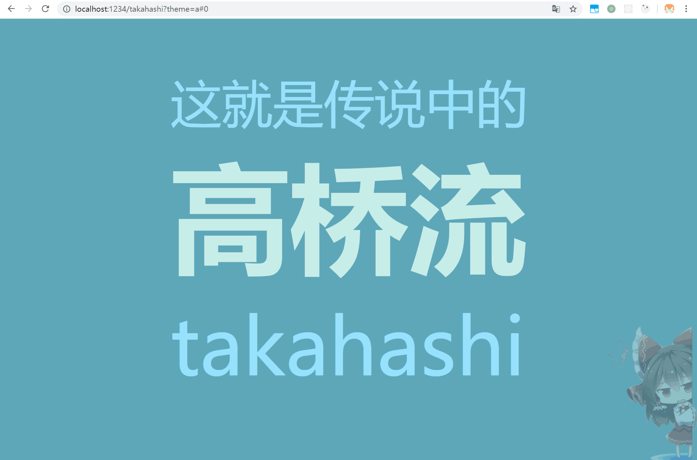
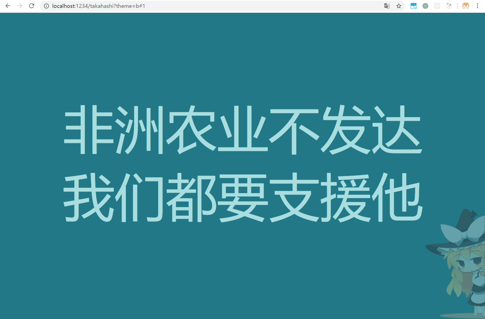
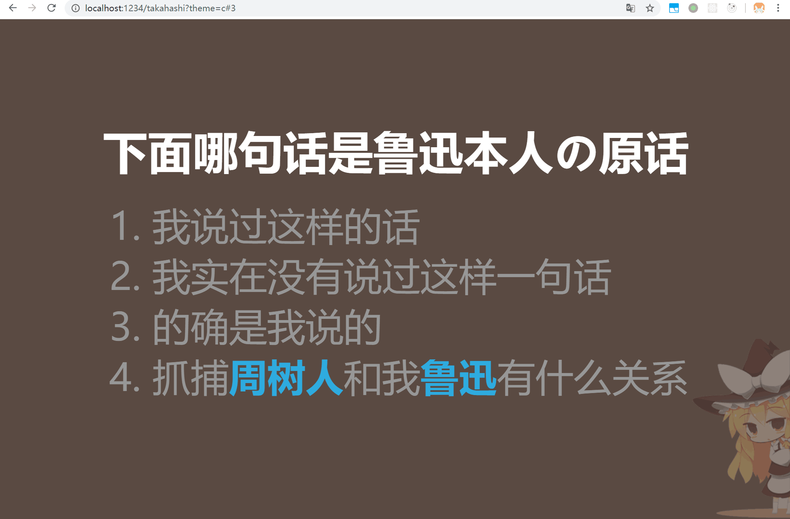
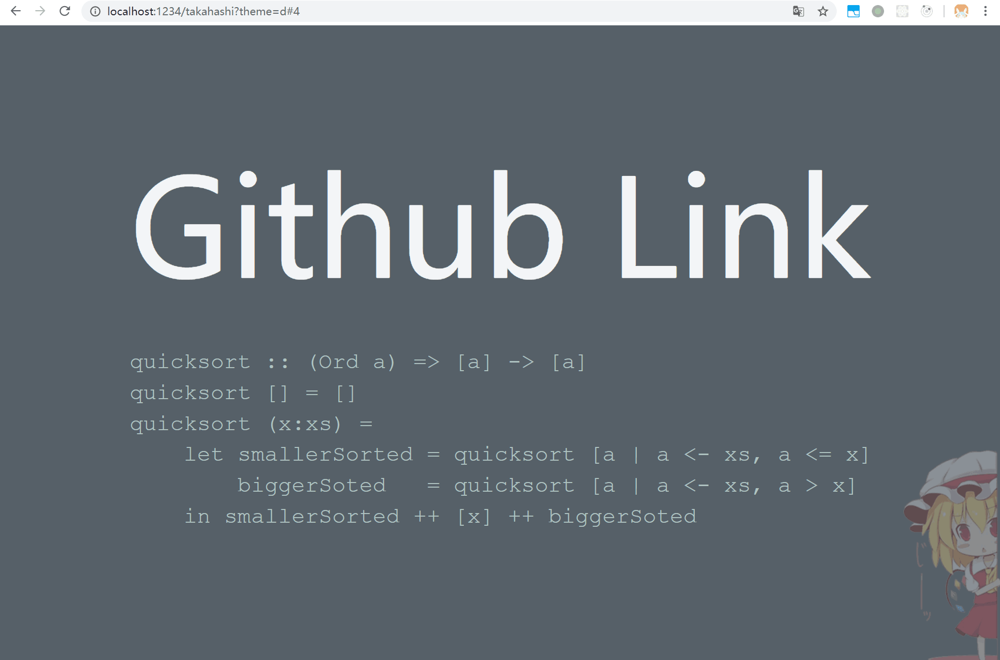

# 高桥流 PPT 生成器

~~什么 PowerPoint，什么 KeyNote，我从来都是高桥流一把梭~~

这是一个自用的高桥流网页 PPT 生成工具

## 使用方式

1. 下载源码到本地，安装依赖 `yarn`

2. 参考 `takahashi.html` 在 ppt 文件夹下新增你的 ppt 文件

3. 运行项目 `yarn run dev`，随后浏览器打开 `http://localhost:1234/takahashi?theme=a#0`

## 主题

默认有 a, b, c, d, dark 五套主题，在 URL 中增加 `?theme=dark` 改变主题

